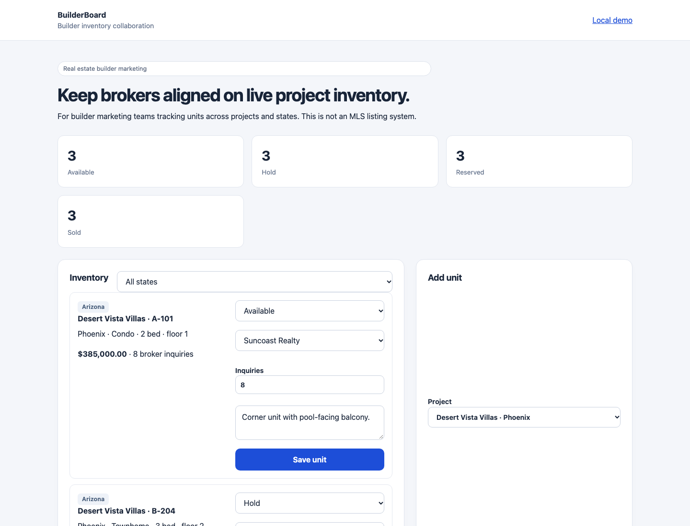

# BuilderBoard



BuilderBoard is a real-estate inventory collaboration demo for builder marketing teams and broker networks.

It is designed for builders who need to know which units are available, on hold, reserved, or sold across multiple projects and states. It is not an MLS listing system and does not scrape or publish public property listings.

## Run

```sh
python3 server.py
```

Open `http://127.0.0.1:8111`.

## What it demonstrates

- Multi-project builder inventory management
- State/city/project filtering
- Unit-level status: available, hold, reserved, sold
- Broker assignment and inquiry counts
- Shared marketing notes for broker collaboration
- SQLite persistence and local tests

This is a local portfolio demo. It does not include broker authentication, MLS feeds, public listings, payments, or legal offer management.
